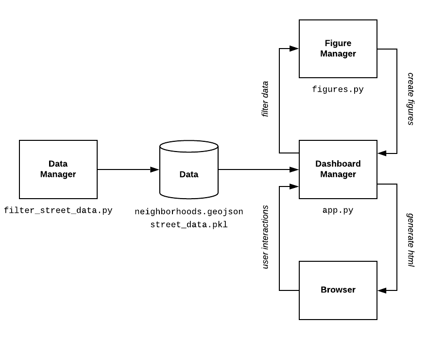

# Component Specification

## Software Components

* **Data manager**: Pre-process raw data
   * What it does: Load raw data, join data by neighborhood and street, reformat data for Plotly figures
   * Input: Data from Zillow and City of Seattle
   * Output: Reformatted csv files and Pandas DataFrames to dashboard and figure managers
* **Dashboard manager**: HTML structure of dashboard
   * What it does: Create HTML components for headers, maps, charts, and interactive components
   * Input: Data from data manager, current state of interactive components from browser, Plotly figures from figure manager
   * Output: Current state to figure manager, HTML components to browser
* **Figure manager**: Create Plotly figures
   * What it does: Create Plotly figures for maps and charts
   * Input: Data from data manager, current state from dashboard manager
   * Ouput: Plotly figures to dashboard manager

## Interactions
User selects neighborhood, year, or map type using dashboard controls:
  * Browser sends current state of interactive components to dashboard manager
  * Dashboard manager sends current state to figure manager
  * Figure manager sends Plotly figures for current state to dashboard manager
  * Dashboard manager sends HTML for current state to browser

## Preliminary Plan
1. Initialize package structure in repository, including CI and tests
2. Create functions to pre-process raw data
3. Create dashboard template, including HTML components for maps, charts, and interactive components
4. Create CSS stylesheet to make dashboard look nice
5. Create functions to create Plotly maps and charts
6. Create callback functions to update Plotly maps and charts
